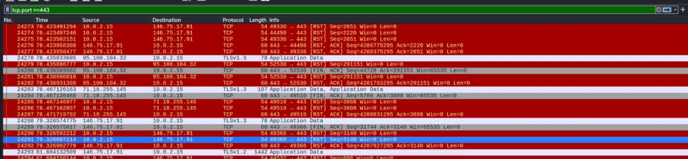

# SOC Project 1 — Network Traffic Analysis

## 📌 Overview
This project focuses on analyzing network traffic using Wireshark to identify normal and potentially suspicious activity.

## 🛠️ Tools Used
- Wireshark  
- Kali Linux  

## 🎯 Objectives
- Capture live network traffic  
- Analyze protocols (DNS, TCP, ICMP)  
- Identify suspicious patterns  

---

## 🔍 Traffic Analysis Findings

### DNS Traffic
- Observed DNS queries to external domains (e.g., TikTok)
- Traffic appeared normal

### HTTPS Traffic (Port 443)
- Encrypted traffic observed
- No anomalies detected

### ICMP (Ping)
- Normal echo requests and replies
- No suspicious activity

### TCP Traffic
- Multiple TCP reset (RST) packets observed
- Could indicate:
  - connection interruptions  
  - server-side resets  
  - or network instability  

---

## 📸 Evidence

### TCP Traffic Analysis

---

## ⚠️ Analysis & Interpretation
- Majority of traffic was legitimate  
- TCP resets require monitoring but are not immediately malicious  
- No clear indicators of compromise (IOC) found  

---

## 🧠 Skills Demonstrated
- Network traffic analysis  
- Protocol understanding (DNS, TCP, ICMP)  
- Basic threat detection  
- Wireshark usage  

---

## 📊 Conclusion
This analysis shows how normal vs suspicious traffic can be identified using packet inspection tools.  
Further monitoring is recommended for unusual TCP reset behavior.

---
